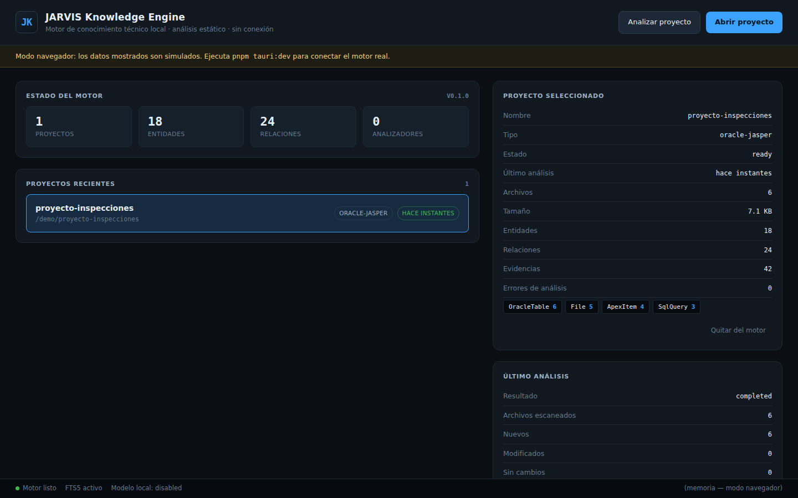

# HANA Knowledge Engine

Aplicación de escritorio local que analiza proyectos técnicos —Oracle, APEX,
PL/SQL, Blue Yonder/JDA MOCA, JasperReports, JSON, XML, JavaScript y Python—, los
convierte en un **grafo de conocimiento con procedencia verificable**, y permite
explorarlo sin enviar nada fuera del equipo.

No es un chatbot. No es un servidor web. No usa OpenAI ni ninguna API externa.

> **Estado: Etapa 1 completa.** Base ejecutable con escaneo seguro, hashing,
> análisis incremental, persistencia y pantalla de inicio. Los analizadores
> (SQL, APEX, MOCA, JRXML, JSON) llegan en la Etapa 2 — ver
> [`ROADMAP.md`](ROADMAP.md).

---



## Qué hace hoy

* Registra una carpeta como proyecto y la escanea de forma segura.
* Calcula el SHA-256 de cada archivo y detecta qué cambió desde el análisis previo.
* Analiza **solo** los archivos nuevos o modificados.
* Guarda archivos, versiones, entidades, relaciones, evidencias y ejecuciones en
  SQLite con búsqueda de texto completo FTS5.
* Conserva todo el conocimiento al cerrar y reabrir la aplicación.
* Funciona con el adaptador de red desconectado.

* Extrae tablas y columnas Oracle, distinguiendo **lectura de escritura**.
* Detecta items APEX (`:P117_NUMCTL`), infiere su página y, cuando el SQL lo
  prueba, los conecta con la columna que alimentan.
* Lee reportes JasperReports con un parser XML real: campos, parámetros,
  variables, consultas, imágenes y subreportes — y avisa de campos usados sin
  declarar y de parámetros declarados sin usar.
* Descompone pipelines MOCA: comandos, variables `@x`, `publish data`,
  `catch(@?)` y el SQL embebido.
* Recorre JSON y código JavaScript/Python.

Sobre las 5 carpetas de ejemplo produce **70 entidades, 143 relaciones y 242
evidencias**, todas con archivo, línea y fragmento.

## Qué todavía no hace

* Mostrar el grafo interactivo — Etapa 3.
* Visor de código y buscador global en la interfaz — Etapas 3 y 4.

La pantalla de inicio muestra los contadores reales, pero explorar el grafo
evidencia. Es poco, pero es real: todo lo que se muestra viene de la base.

---

## Requisitos

| Herramienta | Versión | Necesaria para |
|---|---|---|
| Python | ≥ 3.11 | El motor (sin dependencias externas) |
| Node.js | ≥ 20 | La interfaz |
| pnpm | ≥ 9 | Gestor del monorepo |
| Rust | ≥ 1.77 | El host nativo y `hana-fs` |

### Windows

1. **Python 3.11+** desde [python.org](https://www.python.org/downloads/windows/)
   — marca *Add python.exe to PATH* durante la instalación.
2. **Node.js 20+** desde [nodejs.org](https://nodejs.org/), y después
   `npm install -g pnpm`.
3. **Rust** desde [rustup.rs](https://rustup.rs/).
4. **Microsoft Visual Studio C++ Build Tools** con la carga de trabajo
   *Desktop development with C++*. Tauri no compila sin ella.
5. **WebView2 Runtime** — ya viene con Windows 11 y con Windows 10 actualizado;
   si falta, se descarga del sitio de Microsoft.

Comprobación:

```powershell
python --version
node --version
pnpm --version
cargo --version
```

### Linux (solo desarrollo)

Además de lo anterior:

```bash
sudo apt install libwebkit2gtk-4.1-dev libgtk-3-dev librsvg2-dev
```

El motor y `hana-fs` se prueban **sin** estas bibliotecas; solo hacen falta para
compilar la carcasa de escritorio.

---

## Puesta en marcha

```bash
git clone <repositorio>
cd hana-knowledge-engine

pnpm install                      # dependencias de la interfaz
pip install -e "engine[dev]"      # el motor, en modo editable
```

### Ejecutar la aplicación de escritorio

```bash
pnpm tauri:dev
```

Arranca Vite, compila el host Rust y lanza la ventana. El motor Python se
arranca como proceso hijo automáticamente.

### Ejecutar solo la interfaz (sin Rust)

```bash
pnpm dev        # http://localhost:5183
```

Sin la carcasa de Tauri, la interfaz usa un motor **simulado** y lo indica con un
aviso en pantalla. Útil para trabajar en la UI en una máquina sin toolchain
nativo.

### Usar el motor sin interfaz

El motor es un paquete Python normal y se puede conducir entero desde la terminal:

```bash
cd engine

python -m hana_engine.cli scan ../fixtures            # simulacro, no persiste
python -m hana_engine.cli open ../fixtures            # registrar el proyecto
python -m hana_engine.cli analyze <project-id>        # analizarlo
python -m hana_engine.cli projects                    # proyectos recientes
python -m hana_engine.cli stats <project-id>          # métricas
python -m hana_engine.cli history <project-id>        # historial
python -m hana_engine.cli status                      # estado del motor
```

Con `--json` en cualquier comando la salida es JSON. Con `--db RUTA` se elige otra
base de conocimiento.

---

### Generar un ejecutable

```bash
python -m pip install pyinstaller
pnpm build:desktop
```

Congela el motor Python en un binario propio y lo empaqueta dentro de la
aplicación, de modo que **el instalador resultante no necesita Python** en la
máquina destino. Los artefactos quedan en
`apps/desktop/src-tauri/target/release/bundle/`.

Para Windows sin tener Windows: el flujo de trabajo
[`.github/workflows/build-windows.yml`](.github/workflows/build-windows.yml)
compila el instalador `.msi`/`.exe` en un runner de GitHub. Se dispara desde la
pestaña *Actions* → *Build Windows* → *Run workflow*, o publicando una etiqueta
`v*`, que además crea una release con los archivos adjuntos.

---

## Pruebas

```bash
pnpm test              # las tres suites
pnpm test:engine       # pytest        (155 pruebas)
pnpm test:native       # cargo test    (30 pruebas)
pnpm test:ui           # vitest        (22 pruebas)
```

Cada suite corre de forma aislada: pytest no necesita Node ni Rust, `cargo test
-p hana-fs` no necesita Tauri ni Python, y vitest no necesita ninguno.

---

## Estructura

```
hana-knowledge-engine/
├── apps/desktop/            Aplicación de escritorio
│   ├── src/                 React + TypeScript (vistas, estado, cliente)
│   └── src-tauri/           Host Rust: comandos, sidecar, capacidades
├── crates/hana-fs/        Escaneo y hashing seguros (sin dependencia de Tauri)
├── engine/                  Motor Python
│   └── hana_engine/
│       ├── domain/          Entidades, relaciones, confianza, nombres, plugins
│       ├── persistence/     Esquema SQLite, migraciones, repositorios
│       ├── indexing/        Escáner headless, política, tipos de archivo
│       ├── pipeline/        Detección de cambios y orquestación
│       ├── analyzers/       Plugins (Etapa 2)
│       ├── models/          Proveedores de modelo local (deshabilitado)
│       └── ipc/             Sidecar JSON-Lines
├── packages/shared-types/   Vocabulario compartido con TypeScript
├── fixtures/                Datos de prueba (SQL, JRXML, MOCA, JSON)
├── docs/                    Contrato de escaneo, protocolo IPC
└── scripts/                 Utilidades de desarrollo y compilación
```

---

## Dónde se guarda el conocimiento

Un único archivo SQLite:

| Sistema | Ruta |
|---|---|
| Windows (aplicación empaquetada) | `%APPDATA%\com.hana.knowledge-engine\hana.db` |
| Windows (motor suelto / CLI) | `%APPDATA%\HanaKnowledgeEngine\hana.db` |
| Linux | `~/.local/share/hana-knowledge-engine/hana.db` |

Se puede cambiar con la variable de entorno `HANA_DATA_DIR`. Borrar ese archivo
borra todo el conocimiento; **no toca ningún archivo de tus proyectos**.

---

## Seguridad

HANA lee código de producción, así que asume que ese material es sensible:

* **Nada sale del equipo.** Sin API externas, sin telemetría, sin red.
* **Nada se ejecuta.** El análisis es estático: ni SQL, ni PL/SQL, ni MOCA, ni
  JavaScript, ni Python, ni expresiones de JRXML.
* **Nada se modifica.** Los archivos analizados se abren en solo lectura.
* **Nada fuera del proyecto.** Solo se leen las carpetas que abriste desde el
  diálogo del sistema operativo; los enlaces simbólicos no se siguen.

Detalle completo en [`SECURITY.md`](SECURITY.md).

---

## Verificar que funciona

```bash
cd engine
DB=/tmp/hana-demo.db

PID=$(python -m hana_engine.cli --db $DB --json open ../fixtures \
      | python -c "import sys,json;print(json.load(sys.stdin)['id'])")

python -m hana_engine.cli --db $DB analyze $PID   # added: 5
python -m hana_engine.cli --db $DB analyze $PID   # unchanged: 5, analyzed: 0

echo "-- comentario" >> ../fixtures/sql/guardar_inspeccion.sql
python -m hana_engine.cli --db $DB analyze $PID   # modified: 1, analyzed: 1
```

La tercera ejecución debe reportar **exactamente un archivo modificado**. Si
reporta más, el análisis incremental está roto.

---

## Documentación

| Documento | Contenido |
|---|---|
| [`ARCHITECTURE.md`](ARCHITECTURE.md) | Capas, dominio, deduplicación, decisiones |
| [`SECURITY.md`](SECURITY.md) | Modelo de amenazas y garantías |
| [`ROADMAP.md`](ROADMAP.md) | Etapas y alcance |
| [`IMPLEMENTATION_PLAN.md`](IMPLEMENTATION_PLAN.md) | Plan y riesgos |
| [`docs/SCAN_CONTRACT.md`](docs/SCAN_CONTRACT.md) | Invariantes compartidas de los escáneres |
| [`docs/IPC_PROTOCOL.md`](docs/IPC_PROTOCOL.md) | Protocolo JSON-Lines |

## Licencia

MIT — ver [`LICENSE`](LICENSE).
